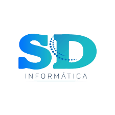

# SD Informática - Guia de Instalação e Documentação

Este projeto é um portal de documentação e ajuda dedicado aos sistemas PDV e Retaguarda da **SD Informática**. 
Ele fornece guias passo a passo, requisitos de sistema, solução de problemas e vídeoaulas para auxiliar 
no processo de instalação, configuração e uso dos softwares.

## Lonk do Projeto

**URL**: https://guia-sd.netlify.app/

